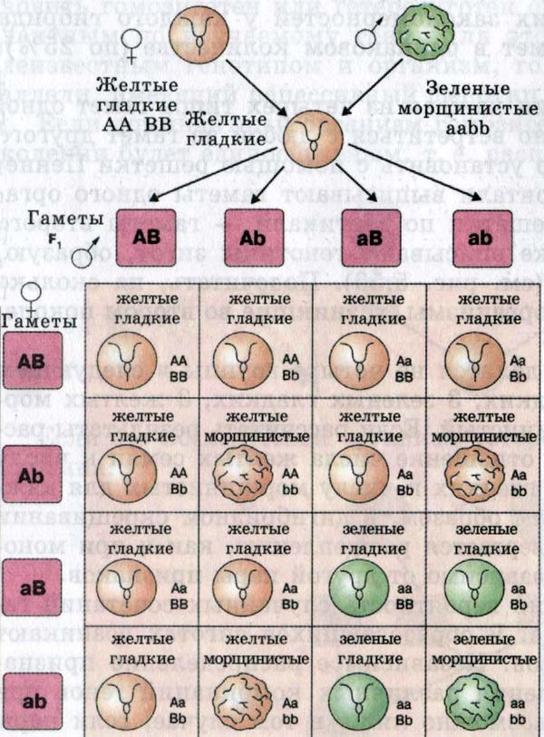

Генетика Менделя
================

Описание
--------

В данном задании предлагается реализовать программную библиотеку, представляющую
встроенный язык программирования для моделирования наследования признаков
по Менделю.

Предсказывание наличия признаков у поколений основывается на нескольких законах Менделя:

Первый закон Менделя
: Каждый организм обладает парой *аллелей* (мы рассматриваем диплоидные организмы) для каждого
  отдельного свойства. При размножении для передачи потомку выбирается одна аллель случайным образом.

Второй закон Менделя.
: Различные признаки организма наследуются независимо друг от друга.

Третий закон Менделя.
: Аллели бывают доминантные и рецессивные. При наличии обеих аллелей организм проявляет признак,
  закодированный в доминантной аллели. Таким образом, если один родитель имеет две доминантные
  аллели, то первое потомство всегда будет проявлять доминантный признак.

**Генотип** — это набор аллелей для каждого признака (например, **AAbbCc**).

**Фенотип** — это набор проявляющихся свойств (например, **AbC**).

Основные задачи, связанные с генетикой Менделя:

- определение признаков $$n$$-ого потомства (процентные соотношения) при известном генотипе родителей;
- определение генотипа родителей при известном фенотипе родителей и потомства.

Созданная библиотека должна предоставлять удобные стредства для решения подобных задач.

Минимальные требования (базовая часть)
--------------------------------------

Базовая реализация проекта, в которой должны разбираться все участники, должна:

- описывать структуры, представляющие генотип, фенотип и распределение вероятностей в поколении;
- предоставлять функции для задания генотипа организма;
- предоставлять функцию для вычисления первого поколения потомства.

Расширенная библиотека (дополнительная часть)
---------------------------------------------

Библиотека для работы с генетикой Менделя должна быть расширена как минимум
двумя различными возможностями:

- отдельный модуль для работы с распределениями вероятностей;
- пользовательские признаки/наборы признаков (библиотека не должна зависеть от какого-то заданного набора признаков);
- не менделевская генетика:
  - множественные аллели (каждый признак может диктоваться не двумя, а произвольным количеством аллелей);
  - ко-доминантные аллели (аллели, которые не доминируют друг над другом; например, из трёх аллелей две могут доминантны над третей, но ко-доминантны между собой);
  - многогенное наследование;
  - и т.п.;
- функции определения потомства с и без вовлечения родителей в процессы скрещивания потомства;
- функции определения возможного генотипа родителей по распределению вероятностей потомства (любого поколения);
- и т.д.

Графический интерфейс (дополнительная часть)
--------------------------------------------

Графический интерфейс должен предоставлять визуальное представление фенотипа,
буквенное представление генотипа, и визуальное разделение поколений.

Графический интерфейс должен реализовывать хотя бы 2 различные возможности:

- визуализация наследования признаков при помощи решётки Пеннета;
- расчёт следующего поколения (с выбором организмов предыдущих поколений, которые будут вовлечены в процесс скрещивания);
- интерфейс для задания распределения генотипа/фенотипа популяции организмов;
- определение родителей по популяции организмов;
- меню выбора организмов из базы;
- меню создания организмов (заведение наборов признаков);
- и т.д.

Работа с базой данных (дополнительная часть)
--------------------------------------------

Модуль для работы с базой данных должен предоставлять хотя бы 2 различные возможности:

- база признаков;
- база организмов;
- база популяций;
- и т.д.
