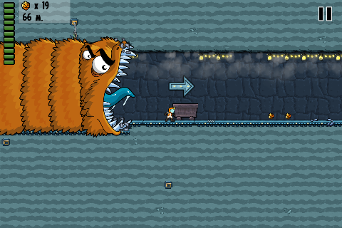
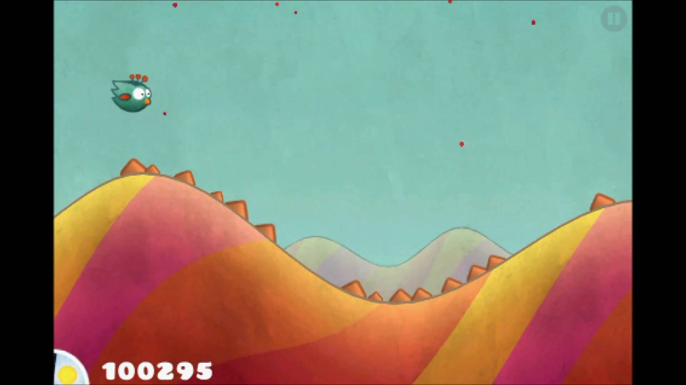

Бесконечный платформер
======================

Описание
--------

Платформер — это жанр компьютерных игр, в которых основной чертой игрового процесса является прыгание по платформам,
лазанье по лестницам, собирание предметов, обычно необходимых для завершения уровня.

Бесконечны платформер — это платформер, в котором персонаж бежит в одном направлении
по миру, который генерируется по ходу движения. Таким образом, игровой мир потенциально бесконечен.

Основная цель игры — добежать как можно дальше.

В данном задании предлагается любую разновидность бесконечного платформера.

{:width="45%"}
{:width="53.5%"}

Минимальные требования (базовая часть)
--------------------------------------

Базовая реализация проекта, в которой должны разбираться все участники, должна:

- предоставлять простейшую генерацию игрового мира — повторение заданного шаблона;
- создавать игровой мир с возможность проиграть или двигаться дальше;
- предоставлять минимальное управление персонажем;
- определять момент поражения и подсчитывать пройденную дистанцию.

Расширенный интерфейс (индивидуальная часть)
--------------------------------------------

Расширенный интерфейс должен добавлять хотя бы 2 различные возможности к базовому интерфейсу.
Ниже перечислены возможные варианты расширения интерфейса, однако этим списком они не ограничены:

- меню:
  - просмотр таблицы рекордов;
  - интерфейс сохранения/загрузки игр;
  - выбор режимов игры:
    - однопользовательская/многопользовательская;
    - уровни сложности;
- расширения игры:
  - многопользовательский режим;
  - бонусы и специальные объекты, которые может подбирать персонаж;
  - различные препятствия;
  - отмотка времени;
- и т.д.

Генератор игрового мира (индивидуальная часть)
----------------------------------------------

Генератор игрового мира должен постепенно повышать сложность трассы.

Для реализации различных режимов игры, генератор должен быть конфигурируемым.
В частности, пользователь генератора должен иметь возможность

- ограничить объекты игрового мира, используемые для генерации;
- определить относительную сложность трассы, на которой может появляться заданный объект;
- определить частоту встречаемости объекта на трассе (в зависимости от сложности);
- и т.д.

Искусственный интеллект (индивидуальная часть)
----------------------------------------------

Алгоритм поведения, никак не оценивающий ситуацию (например, случайное движение),
не считается за реализацию искусственного интеллекта.

Искусственный интеллект в бесконечном платформере может управлять
- активными противниками персонажа, встречающиеся на пути;
- соперничающим персонажем (в многопользовательском режиме вместо второго игрока).

Реализация искусственного интеллекта должна предоставлять настройки сложности.

Клиент-серверная архитектура (индивидуальная часть)
---------------------------------------------------

Помимо возможности просто играть в игру по сети (см. Минимальные требования),
клиент-серверная архитектура должна предоставлять хотя бы 2 дополнительные возможности:

- поддержка нескольких игровых сессий одновременно;
- запуск ИИ на серверной стороне;
- регистрация, аутентификация и авторизация (вход в систему и права на доступ);
- доступ к таблице рекордов;
- сохранение/загрузка игр;
- и т.д.

Работа с базой данных (индивидуальная часть)
--------------------------------------------

Модуль для работы с базой данных должен предоставлять хотя бы 2 различных возможности:

- таблица рекордов;
- сохранения игровых сессий;
- база пользователей;
- и т.д.

