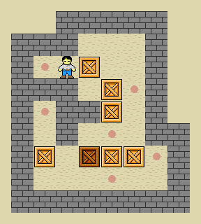

<link rel="stylesheet" href="//maxcdn.bootstrapcdn.com/font-awesome/4.7.0/css/font-awesome.min.css">

Сокобан
=======

Описание
--------

Сокобан — логическая игра-головоломка, в которой игрок передвигает ящики по лабиринту,
показанному в виде плана, с целью поставить все ящики на заданные конечные позиции.
Только один ящик может быть передвинут за раз, причём герой игры — «кладовщик» — может только толкать ящики, но не тянуть их.

В данном задании допускается реализация любой разновидности головоломки, включая следующие возможные модификации:

- использование нестандартной сетки (например, треугольной или гексагональной);
- использование более одного «кладовщика»;
- добавление игровых элементов (например, телепортов, односторонних проходов, лишних предметов и пр.)
- и т.д.

Минимальные требования (базовая часть)
--------------------------------------

Базовая реализация проекта, в которой должны разбираться все участники, должна включать:

- интерфейс решения головоломки;
- загрузка головоломки из файла.

Расширенный интерфейс (индивидуальная часть)
--------------------------------------------

Расширенный интерфейс должен добавлять хотя бы 2 различные возможности к базовому интерфейсу.
Ниже перечислены возможные варианты расширения интерфейса, однако этим списком они не ограничены:

- меню выбора головоломок;
- запуск и визуализация процесса автоматического решателя;
- таймер решения головоломки;
- просмотр таблицы рекордов и архива решенных головоломок;
- интерфейс сохранения/загрузки частичного решения;
- редактор головоломок;
- и т.д.

Генерация и автоматическое решение головоломок (индивидуальная часть)
---------------------------------------------------------------------

В этой индивидуальной части требуется реализовать генерацию головоломок и автоматический решатель.

Генерация головоломки может быть реализована различными способами.
Однако, наиболее стабильный способ генерации, пожалуй, использование небольшого числа
шаблонов, совмещаемых некоторое количество раз. При хорошем выборе начальных
шаблонов вероятность генерации решаемой головоломки может быть достаточно высока.

Идеи о генерации головоломок можно черпать из статьи [<i class="fa fa-lg fa-fw fa-file-pdf-o"></i> Automatic Making of Sokoban Problems](http://citeseerx.ist.psu.edu/viewdoc/download?doi=10.1.1.47.2303&rep=rep1&type=pdf).

После генерации головоломки, её сложность должна быть оценена при помощи автоматического решателя.

Автоматическое решение головоломки может также быть реализовано несколькими способами.
Для реалистичной оценки сложности головоломок, рекомендуется использовать стратегии, моделирующие решение человеком.
При решении на каждом шаге пробуются стратегии, начиная с самой простой, и первая подходящая используется.
Средняя сложность использованных стратегий может расцениваться как общая сложность головоломки.

Выбор из нескольких заранее подготовленных головоломок не считается генерацией.

Работа с базой данных (индивидуальная часть)
--------------------------------------------

Модуль для работы с базой данных должен предоставлять хотя бы 2 различных возможности:

- таблица рекордов;
- сохранения игровых сессий;
- база головоломок;
- и т.д.

